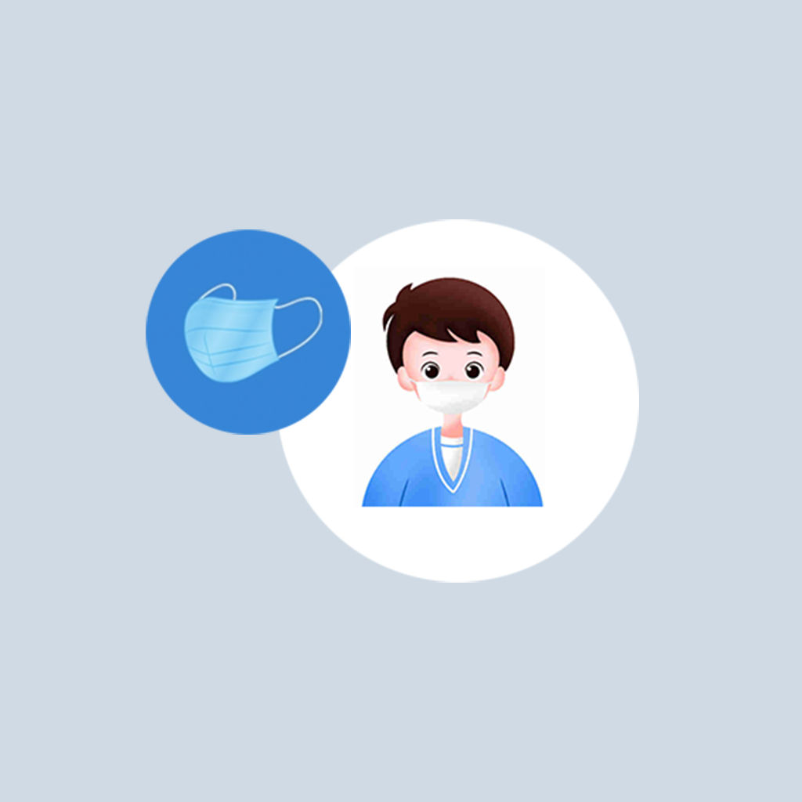

## Welcome to My Daily Mask Hygiene Record

We often use masks in our daily life. For example, we need to wear masks when cleaning. We also need to wear masks when there are more dust or sensitive pollen particles in the air. The health of the mask is very important to our health. Forming a good mask health habit can help us avoid unnecessary infections and diseases. We can record our daily habits of using masks, the number of masks, whether to clean them, the number and time of replacement. You can organize this information into a list, so that you can check whether the mask is hygienic and reasonable every time you use it, and help you form a good habit of using the mask.

If you have any questions, you can either leave a message or send the questions to our email address.

We will answer them for you in the first time.

### Address: BeatriceArlenexSgPdE@yahoo.com

Thank you!
